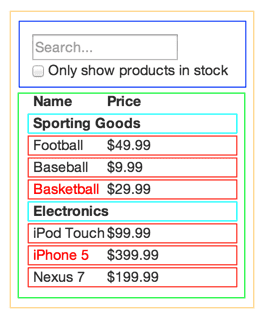

# Thinking in React

- Let's build a searchable product data table using React

## Start with a mock

- Imagine a JSON API and a mock from the designer

```
// JSON API data
[
  {category: "Sporting Goods", price: "$49.99", stocked: true, name: "Football"},
  {category: "Sporting Goods", price: "$9.99", stocked: true, name: "Baseball"},
  {category: "Sporting Goods", price: "$29.99", stocked: false, name: "Basketball"},
  {category: "Electronics", price: "$99.99", stocked: true, name: "iPod Touch"},
  {category: "Electronics", price: "$399.99", stocked: false, name: "iPhone 5"},
  {category: "Electronics", price: "$199.99", stocked: true, name: "Nexus 7"}
];
```

## Step 1: break the UI into a component hierarchy

- Draw boxes around every component (and sub-component) in the design mock and give them names
- Now, what should be its own component? Use the same technique for deciding if one should create a new function or object. One such technique is the single responsibility principle (SRP) where a component should ideally do one thing. If the component ends up growing, it should be decomposed into smaller sub components
- UI and data model tend to adhere to the same information architecture, so one will find them map nicely if the model was built correctly. Separate UI into components where each component matches one piece of the data model



- We have really 5 components for the app
1. FilterableProductTable (orange): container
2. SearchBar (blue): receives all user input
3. ProductTable (green): displays and filters the data collection based on user input
4. ProductCategoryRow (turquoise): displays a heading for each category
5. ProductRow (red): display a row for each product

- Let's arrange into a hierarchy now that we've identified the components
- Components that appear within another component in the mock should appear as a child in the hierarchy

```
FilterableProductTable
  SearchBar
  ProductTable
    ProductCategoryRow
    ProductRow
```

## Step 2: build a static version in React

- Easiest way is to build a version that takes the data model and renders the UI but has no interactivity
- It's best to decouple these (UI render and interactivity) since building a static version requires a lot of typing and no thinking, and adding interactivity requires a lot of thinking a not a lot of typing
- For a static version, one will want to build components that reuse other components and pass data using props
- `props` are a way of passing data from parent to child and we should not use `states` at all since that's reserved only for interactivity where data changes over time, since we're building something static, it's not needed
- One can build top-down or bottom-up (e.g. start with FilterableProductTable or ProductRow)
- Simpler examples are usually easier going top-down and larger projects is usually easier going bottom-up and write tests as one builds
- Component at the top of the hierarchy will take the data model as a prop
- React's one-way data flow (also known as one-way binding) keeps everything module and fast

## Step 3: identify the minimal (but complete) representation of UI state

- Making changes to the underlying data model is done with React state
- To build apps correctly, first think of minimal set of mutable state that apps need
- The key is to keep it DRY (Don't Repeat Yourself) and find the absolute minimal representation of the state the application needs and compute everything else needed on-demand. E.g. if building a TODO list, keep an array of the TODO items around; don't keep a separate state for count
- In our example application, all the pieces of data are:
  - Original list of products
  - Search text the user has entered
  - Value of the checkbox
  - Filtered list of products
- Let's see which one is a state by asking the following questions
  1. Is it passed in from a parent via props? If so then probably not a state
  2. Does it remain unchanged over time? If so, probably isn't state
  3. Can one compute it based on any other state or props in the component? If so, not a state
- Original list of products is passed in as props, so that's not state
- Search and checkbox seem to be state since they change over time and can't be computed from anything
- Filtered list of products isn't state since it can be computed by combining the original list of products with search text and the value of the checkbox

## Step 4: identify where your state should live

- Now, we need to identify which components mutate or owns different states
- React is all about one-way data flow down the component hierarchy
- We can follow the following procedure to determine where states should live
  - Identify every component that renders something based on that state
  - Find a common owner component (single component above all the components that need the state in the hierarchy)
  - Either the common owner or another component higher up in the hierarchy should own the state
  - If a component can't be found to own the state, create a new component solely for holding the state and add it somewhere in the hierarchy above the common owner component

- `ProductTable` needs to filter the product list based on state and `SearchBar` needs to display the search text and checked state
- Common owner component is `FilterableProductTable`, so it conceptually makes sense for the filter text and checked value to live in `FilterableProductTable`

## Step 5: add inverse data flow

- The form component deep in the hierarchy need to update the state in FilterableProductTable
- React makes this data flow explicitly to help understand how one program works, but it requires a bit more typing than the traditional two-way data binding
- If one tries to type of check the box in the current version of the example, React will ignore the inputs. This is because the `value` prop of the `input` is set to always be the `state` passed in from `FilterableProductTable`
- We want to make sure that whenever the user changes the form, the state is updated to reflect the user input. Since **components should only update their own state**, `FilterableProductTable` will pass callbacks to `SearchBar` that'll fire whenever the state should be updated
- One can use the `onChange` event on the inputs to be notified of it
- The callback passed by `FilterableProductTable` will call `setState()` and the app will be updated
- NOTE: Personally, I've been passing down state setters since hook setters are easily passable. When in a class component, remember to create an explicitly handler function to make state changes. I think hook setters should follow the same pattern

- See source code here: https://codepen.io/gaearon/pen/LzWZvb
