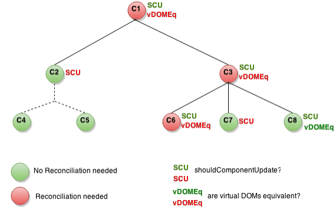

# Optimizing performance

- Internally, React uses several clever techniques to minimize the number of costly DOM operations required to update the UI
- For many applications, using React will lead to a fast UI without doing much work to specifically optimize for performance
- Nevertheless, there are several ways one can speed up a React app

## Use the production build

- If one is benchmarking or experiencing performance problems in a React app, makes ure to test with the minified production build
- By default, React includes many helpful warnings, which are very useful in development, but they make React larger and slower so one should make sure to use the production version when deploying the app
- If you aren't sure whether a build process is set up correctly, check it by installing the React devtool for Chrome. If a site with React is in production mode, the icon will have a dark background


- When visiting in development mode, the icon will have a red background


- It's expected that one uses the development mode when working on the app and production mode when deploying app to the users

### CRA

- If a project is built with CRA, simply run `npm run build`
- This creates a production build of the app in the `build/` folder of the project
- This is only necessary before deploying to production, for normal development, use `npm start`

### Single-file builds

- React offers production-ready version of React and React DOM as single files

```
<script src="https://unpkg.com/react@17/umd/react.production.min.js"></script>
<script src="https://unpkg.com/react-dom@17/umd/react-dom.production.min.js"></script>
```

- Remember that only React files ending with `.production.min.js` are suitable for production

### Brunch

- Brunch is a build tool like Webpack but with a different flavor
- For the most efficient Brunch production build, install [terser-brunch](https://github.com/brunch/terser-brunch)

```
# If you use npm
npm install --save-dev terser-brunch

# If you use Yarn
yarn add --dev terser-brunch
```
- To create a production build, add the `-p` flag to the `build` command

`brunch build -p`

- Remember that one only needs to do this for production builds. One shouldn't pass the `-p` flag or apply this plugin in development, because it'll hide useful React warnings and make the build much slower

### Browserify

- For the most efficient Browserify production build, install a few plugins

```
# If you use npm
npm install --save-dev envify terser uglifyify

# If you use Yarn
yarn add --dev envify terser uglifyify
```

- To create a production build, make sure to add these transforms (**order matters**)
  - `envify` transform ensures the right build environment is set. Make it global (`-g`)
  - `uglifyify` transform removes development imports. Make it global too (`-g`)
  - Resulting bundle is piped to `terser` for mangling

```
// E.g.
browserify ./index.js \
  -g [ envify --NODE_ENV production ] \
  -g uglifyify \
  | terser --compress --mangle > ./bundle.js
```

- Remember that one only needs to do this for production builds

### Rollup

- For the most efficient Rollup production build

```
# If you use npm
npm install --save-dev rollup-plugin-commonjs rollup-plugin-replace rollup-plugin-terser

# If you use Yarn
yarn add --dev rollup-plugin-commonjs rollup-plugin-replace rollup-plugin-terser
```

- To create a production build, make sure to add these transforms (**order matters**)
  - `replace` plugin ensures the right build env is set
  - `commonjs` provides support for CommonJS in Rollup
  - `terser` compresses and mangles to the final bundle

```
plugins: [
  // ...
  require('rollup-plugin-replace')({
    'process.env.NODE_ENV': JSON.stringify('production')
  }),
  require('rollup-plugin-commonjs')(),
  require('rollup-plugin-terser')(),
  // ...
]
```

### webpack

- Note: if using CRA, webpack is already used, so this is only applicable to configuring webpack directly
- Webpack v4+ will minify one's code by default in production mode

```
const TerserPlugin = require('terser-webpack-plugin');

module.exports = {
  mode: 'production',
  optimization: {
    minimizer: [new TerserPlugin({ /* additional options here */ })],
  },
};
```

## Profiling components with the devtool profiler

- `react-dom` 16.5+ and `react-native` 0.57+ provide enhanced profiling capabilities in DEV mode with the React DevTools Profiler
- Note: A production profiling bundle of `react-dom` is also available as `react-dom/profiling`

## Virtualize long lists

- If one's application renders long lists of data (hundreds or thousands of rows), it's recommended to use a technique known as "windowing"
- This technique only renders a small subset of the rows at any given time, and can dramatically reduce the time it takes to re-render the components as well as the number of DOM nodes created
- `react-window` and `react-virtualized` are popular windowing libraries
- They provide several reusable components for displaying lists, grids, and tabular data
- One can also create their own windowing component if something more tailored to the application's specific use case is desired

## Avoid reconciliation

- React builds and maintains an internal representation of the rendered UI
- It includes the React elements that were returned from components
- This representation lets React avoid creating DOM nodes and accessing existing ones beyond necessity, **as that can be slower than the operations on JS objects**
- Sometimes, it's referred to as a "virtual DOM", but it works the same way on React Native
- When a component's props or state change, React decide whether the actual DOM update is necessary by comparing the newly returned element with the previously rendered one. **When they're not equal, React will update the DOM**
- Even though React only updates the changed DOM nodes, re-rendering still takes some time
- In many cases, it's not a problem, but if the slowdown is noticeable, one can speed all of it up by overriding the lifecycle function `shouldComponentUpdate`, which is triggered before the re-rendering process starts
- The default implementation of this function returns `true`, leaving React to perform the update

```
shouldComponentUpdate(nextProps, nextState) {
  return true;
}
```

- If one knows that in some situations a component doesn't need to update, one can return `false` from `shouldComponentUpdate` instead, to skip the whole rendering process, including calling `render()` on this component and below
- In most cases, instead of writing `shouldComponentUpdate()` by hand, one can inherit from `React.PureComponent`. It's equivalent to implementing `shouldComponentUpdate()` with a shallow comparison of current and previous props and state

## shouldComponentUpdate in action

- The following is a subtree of components. For each one, `SCU` indicates what `shouldComponentUpdate` returned, and `vDOMEq` indicates whether the rendered React elements were equivalent
- Finally, the circle's color indicates whether the component had to be reconciled or not



- Since `SCU` returned `false` for subtree rooted at C2, React didn't attempt to render C2, and thus didn't even have to invoke `shouldComponentUpdate` on C4 and C5
- For C1 and C3, `SCU` returned `true`, so React had to go down to the leaves and check them
  - For C6, `SCU` returned `true` and since the rendered elements weren't equivalent React had to update the DOM
- At C8, React had to render this component but since the React elements it returned were equal to the previously rendered ones, it didn't have to update the DOM
- Note that React only had to do DOM mutation for C6, which was inevitable
- For C8, it bailed out by comparing the rendered React elements, and for C2's subtree and C7, it didn't have to compare the elements as we bailed on SCU and render was not called

## Examples

- If the only way a component ever changes is when the `props.color` or the `state.count` variables changes, one could have `shouldComponentUpdate` check that

```
class CounterButton extends React.Component {
  constructor(props) {
    super(props);
    this.state = {count: 1};
  }

  shouldComponentUpdate(nextProps, nextState) {
    if (this.props.color !== nextProps.color) {
      return true;
    }
    if (this.state.count !== nextState.count) {
      return true;
    }

    return false;
  }

  render() {
    return (
      <button
        color={this.props.color}
        onClick={() => this.setState(state => ({count: state.count + 1}))}
      >
        Count: {this.state.count}
      </button>
    );
  }
}
```

- Here, `SCU` is just checking if there is any change in `props.color` or `state.count`. If they don't change, the component doesn't update
- If a component got more complex, one could use a similar pattern of doing a "shallow comparison" between all the fields of `props` and `state` to determine if the component should update
- This pattern is common enough that React provides a helper to use this logic - just inherit from `React.PureComponent`, so the previous code can be simplified to:

```
class CounterButton extends React.PureComponent {
  constructor(props) {
    super(props);
    this.state = {count: 1};
  }

  render() {
    return (
      <button
        color={this.props.color}
        onClick={() => this.setState(state => ({count: state.count + 1}))}
      >
        Count: {this.state.count}
      </button>
    )
  }
}
```

- Most of the time, one can use `React.PureComponent` instead of writing their own `SCU`
- It only does a shallow comparison, so one can't use it if the props or state may have been mutated in a way that a shallow comparison would miss
- This can be a problem with more complex data structures. E.g. let's say one wants a `ListOfWords` component to render a comma-separated list of words, with a parent `WordAdder` component that lets one click a button to add a word to the list, this code doesn't work correctly:

```
class ListOfWords extends React.PureComponent {
  render() {
    return <div>{this.props.words.join(',')}</div>;
  }
}

class WordAdder extends React.Component {
  constructor(props) {
    super(props);
    this.state = {
      words: ['marklar']
    };
    this.handleClick = this.handleClick.bind(this);
  }

  handleClick() {
    // This section is bad style and causes a bug
    const words = this.state.words;
    words.push('marklar');
    this.setState({words: words});
  }

  render() {
    return (
      <div>
        <button onClick={this.handleClick} />
        <ListOfWords words={this.state.words} />
      </div>
    );
  }
}
```

- This issue is that `PureComponent` will do a simply comparison between the old and the new values of `this.props.words`
- Since this code mutates the `word` array in the `handleClick` method of `WordAdder`, the old and new values of `this.props.words` will compare as equal, even though the actual words in the array have changed
- The `ListOfWords` will thus not update even though it has new words that should be rendered

## The power of not mutating data

- The simplest way to avoid this problem is to avoid mutating values that one are using as props or state
- E.g. the `handleClick` method above could be rewritten using `concat` as:

```
handleClick() {
  this.setState(state => ({
    words: state.words.concat(['marklar'])
  }));
}
```

- ES6 supports a spread syntax for arrays which can make this easier. If one is using CRA, this syntax is available by default

```
handleClick() {
  this.setState(state => ({
    words: [...state.words, 'marklar'],
  }));
}
```

- One can also rewrite code that mutate objects to avoid mutation, in a similar way
- E.g. let's say there's an object named `colormap` and we want to write a function that changes `colormap.right` to be `'blue'`, we could write:

```
function updateColorMap(colormap) {
  colormap.right = 'blue';
}
```

- To write it without mutating the original object, one can use `Object.assign` method

```
function updateColorMap(colormap) {
  Object.assign({}, colormap, {right: 'blue'});
}
```

- `updateColorMap` now returns a new object instead of mutating the old one
- `Object.assign` is in ES6 and requires a polyfill
- Object spread syntax makes it easier to update objects without mutation as well

```
function updateColorMap(colormap) {
  return {...colormap, right: 'blue'};
}
```

- This was added to JS in ES2018
- If one's using CRA, both `Object.assign` and the object spread syntax are available by default
- When one deals with deeply nested objects, updating them in an immutable way can feel convoluted
- Check out Immer or immutability-helper if running into this problem