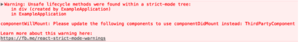

# Strict mode

- StrictMode is a tool for highlighting potential problems in an application
- Like `Fragment`, `StrictMode` does not render any visible UI
- It activates additional checks and warnings for its descendants
- Note: Strict mode checks are run in development mode only; they do not impact the production build
- One can enable strict mode as follows in any part of their application:

```
import React from "react";

function ExampleApplication() {
  return (
    <div>
      <Header />
      <React.StrictMode>
        <div>
          <ComponentOne />
          <ComponentTwo />
        </div>
      </React.StrictMode>
      <Footer />
    </div>
  );
}
```

- In the above, strict mode checks will not be run against `Header` and `Footer` components. `ComponentOne` and `ComponentTwo` as well as all of their descendants will have the checks

- The following are what StrictMode currently helps with

## Identifying unsafe lifecycles

- Certain legacy lifecycle methods are unsafe for use in async React application
- However, if an application uses third party libraries, it can be difficult to ensure that these lifecycles aren't being used. Strict mode can help with this!
- When strict mode is enabled, React compiles a list of all class components using the unsafe lifecycles and logs a warning message with information about these components like so:



- Addressing the issues identified by strict mode now will make it easier for one to take advantage of concurrent rendering in future releases of React

## Warning about legacy string ref API usage

- Previously, React provided two ways for managing this: the legacy string ref API and the callback API
- Although the string ref API was the more convenient of the two, it has several downsides and so our official recommendation was to use the callback from instead
- React 16.3 added a 3rd option that offers the convenience of string ref without any of the downsides

```
class MyComponent extends React.Component {
  constructor(props) {
    super(props);

    this.inputRef = React.createRef();
  }

  render() {
    return <input type="text" ref={this.inputRef} />;
  }

  componentDidMount() {
    this.inputRef.current.focus();
  }
}
```

- Since object refs were largely added as a replacement for string refs, strict mode now warns about usage of string refs
- Note: callback refs will continue to be supported in addition to the new `createRef` API. One doesn't need to replace callback refs in their components. They're slightly more flexible, so will remain as an advanced feature

## Warning about deprecated findDOMNode usage

- React used to support `findDOMNode` to search the tree for a DOM node given a class instance
- Normally, one doesn't need this since they can attach a ref directly to a DOM node
- `findDOMNode` can also be used on class components but this was breaking abstraction levels by allowing a parent to demand that certain children were rendered
- It creates a refactoring hazard where one can't change the implementation details of a component because a parent might be reaching into its DOM node
- `findDOMNode` only returns the first child, but with the use of Fragments, it's possible for a component to render multiple DOM Nodes
- `findDOMNode` is a one time read API. It only gave one an answer when they asked for it. If a child component renders a different node, there's no way to handle this change
- Therefore, `findDOMNode` only worked if component always return a single DOM node that never changes
- One can instead make this explicit by passing a ref to their custom component and pass that along to the DOM using ref forwarding
- One can also add a wrapper DOM node to their component and attach a ref directly to it

```
class MyComponent extends React.Component {
  constructor(props) {
    super(props);
    this.wrapper = React.createRef();
  }

  render() {
    return <div ref={this.wrapper}>{this.props.children}</div>;
  }
}
```

- Note: In CSS, the `display: contents` attribute can be used if one doesn't want the node to be part of the layout

## Detecting unexpected side effects

- Conceptually, React does work in two phases
  - The **render** phase determines what changes need to be made to e.g. the DOM
    - During this phase, React calls `render` and then compares the result to the previous render
  - The **commit** phase is when React applies any change (In the case of React DOM, this is when React inserts, updates, and removes DOM nodes)
    - React also calls lifecycles like `componentDidMount` and `componentDidUpdate` during this phase
- The commit phase is usually very fast, but rendering can be slow
- For this reason, the upcoming concurrent mode (not enabled by default yet) breaks the rendering work into pieces, pausing and resuming the work to avoid blocking the browser
- This means that React may invoke render phase lifecycles more than once before committing, or it may invoke them without committing at all (because of an error or a higher priority interruption)
- Render phase lifecycles include the following class component methods:
  - constructor
  - componentWillMount (or UNSAFE_componentWillMount)
  - componentWillReceiveProps (or UNSAFE_componentWillReceiveProps)
  - componentWillUpdate (or UNSAFE_componentWillUpdate)
  - getDerivedStateFromProps
  - shouldComponentUpdate
  - render
  - setState updater functions (the first argument)
- Because the above methods might be called more than once, it's important that they don't contain side effects
- Ignoring this rule can lead to a variety of problems, including memory leaks and invalid application state
- Unfortunately, it can be difficult to detect these problems as they can often be non-deterministic
- Strict mode can't automatically detect side effects for one, but it can help spot them by making them a little more deterministic
- This is done by intentionally double invoking the following functions:
  - Class component constructor, render, and shouldComponentUpdate methods
  - Class component static getDerivedStateFromProps method
  - Function component bodies
  - State update functions (the first argument to `setState`)
  - Functions passed to useState, useMemo, or useReducer
- Note: This only applies to development. Lifecycles will not be double-invoked in production mode

- Consider the following code:

```
class TopLevelRoute extends React.Component {
  constructor(props) {
    super(props);

    SharedApplicationState.recordEvent('ExampleComponent');
  }
}
```

- At first glance, the code might not seem problematic, but if SharedApplicationState.recordEvent isn't idempotent, then instantiating this component multiple times could lead to invalid application state
- This sort of subtle bug might not manifest during development, or it might do so inconsistently and so be overlooked
- By intentionally double-invoking methods like the component constructor, strict mode makes patterns like this easier to spot
- Note: in React 17, React automatically modifies the console methods like console.log() to silence the logs in the second call to lifecycle functions

## Detecting legacy context API

- The legacy context API is error-prone and will be removed in future major version
- It still works for all 16.x release but will show this warning message in strict mode 

